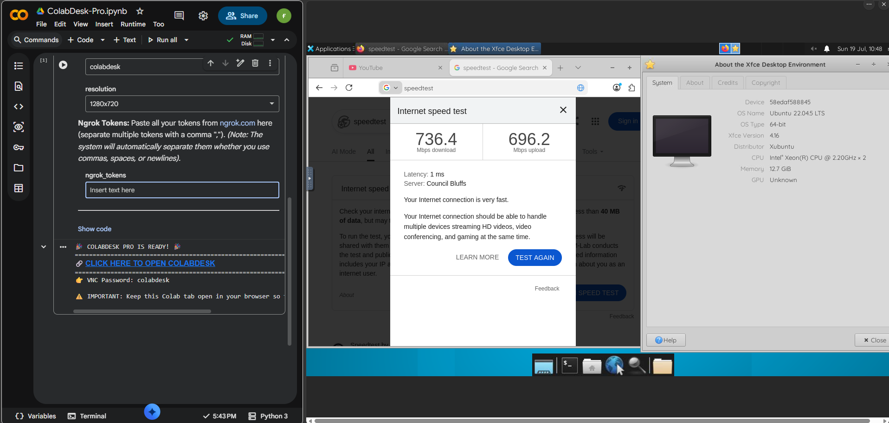

# 🖥️ ColabDesk

**ColabDesk** transforms Google Colab into a fully functional Virtual Desktop PC accessible directly from your web browser, without needing any local VNC viewer installations.

Built for simplicity and minimal user interaction.

  

## ✨ Features
- **One-Click Execution**: No confusing multi-step cells. Fill the form, click run, and you're done!
- **Direct Browser Access**: Powered by noVNC and XFCE4.
- **Mozilla Firefox**: Included as the default web browser.
- **Automated Setup**: Installs desktop environment and tunneling tools automatically.

## 🎯 Use Cases (Why ColabDesk?)
- **Web Scraping & Botting**: Run browser automation (Selenium/Puppeteer) on a remote server without using local resources.
- **Cloud-to-Cloud Transfer**: Leverage Google Colab's massive backbone internet speed for downloading/uploading huge files.
- **Data Science & ML IDE**: Run graphical tools (like JupyterLab UI or VS Code) visually on the cloud.
- **Private Browsing Sandbox**: Surf the web securely using Google's IP address (perfect for avoiding local ISP blocks).
- **Trading & Crypto Bots**: Keep your lightweight bots running in a contained, disposable Linux environment.
- **View Farming (YouTube, etc.)**: Auto-play videos for hours to farm views or watch time without burning your local bandwidth.

## 🚀 How to Use
1. Click here to open the script directly in Google Colab: 
2. On the right-side form, configure your preferred **VNC Password** and **Resolution**.
3. In the **Ngrok Token** field, paste your token from [ngrok.com](https://dashboard.ngrok.com).
4. Click the **Play (Run cell)** button.
5. Wait ~2-3 minutes. A browser link will be generated. Click it, enter your password, and enjoy your cloud desktop!

## ⭐ Upgrade to ColabDesk Pro

Want more power? **ColabDesk Pro** unlocks premium features:

| Feature | Free | Pro |
|:---|:---:|:---:|
| XFCE4 Desktop via noVNC | ✅ | ✅ |
| Ngrok Tunneling | 1 token | Multi-token |
| **Web Browser** | ❌ | Mozilla Firefox |
| **Smart Token Fallback** (auto-retry on rate limits) | ❌ | ✅ |
| **Rate-Limit Detection & Token Rotation** | ❌ | ✅ |
| **Auto-Connect VNC** (no manual password entry) | ❌ | ✅ |
| **Auto-Reconnect** with configurable delay | ❌ | ✅ |
| **Anti-Disconnect Script** (Keep Colab Awake) | ❌ | ✅ |

👉 **Get ColabDesk Pro:**
- 🌍 **Global:** [Gumroad](https://achmadhadikurnia.gumroad.com/)
- 🇮🇩 **Indonesia:** [Lynk.id](https://lynk.id/achmadhadikurnia)

## ☕ Support This Project
If you find this project useful, you can support me here:
- [Buy Me a Coffee](https://www.buymeacoffee.com/achmadhadikurnia)
- [Saweria](https://saweria.co/achmadhadikurnia)

## 📄 License
This project is licensed under the MIT License - see the [LICENSE](LICENSE) file for details.
